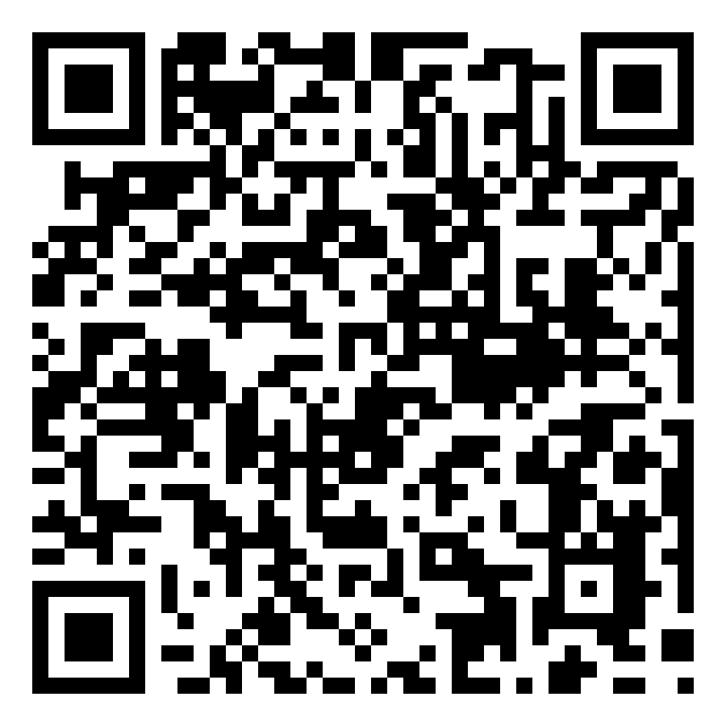

# CalibrationGPSTracker

A high-precision GPS track recorder with real-time tagging, built as a single HTML page. No app store, no SDK, no backend — just open it in your browser.



**Live app:** [https://o-l-r.github.io/calibration-gps-tracker/](https://o-l-r.github.io/calibration-gps-tracker/)

---

## Features

- **High-frequency GPS recording** — captures 1+ point per second using `watchPosition` combined with supplementary 800ms polling
- **Instant tagging** — tap the Tag button at any time to mark a point of interest; each tag is timestamped and linked to the corresponding GPS track point
- **JSON export** — structured output with full metadata, track points, and tags; share via AirDrop, email, Messages, or download directly
- **Offline capable** — service worker caches the app after first load; works without any internet connection
- **Wake Lock** — keeps the screen on during recording so GPS stays active
- **Haptic feedback** — vibration on start, stop, and tag actions (Android and supported iOS devices)
- **Saved tracks** — all recordings are stored in localStorage; browse, share, or delete from the built-in file manager
- **Zero dependencies** — single `index.html` file, no frameworks, no build step, no server required

## How to Install

### iOS (iPhone / iPad)

1. Open Safari and go to:
   ```
   https://o-l-r.github.io/calibration-gps-tracker/
   ```
   Or scan the QR code above with your camera.

2. Tap the **Share** button (square with arrow pointing up).

3. Scroll down and tap **"Add to Home Screen"**.

4. Tap **"Add"** in the top right corner.

5. The app icon now appears on your Home Screen. It launches in full-screen mode like a native app.

> **Note:** The Geolocation API requires HTTPS, which is why the app is served from GitHub Pages. Once added to the Home Screen, it works fully offline thanks to the built-in service worker.

### Android

1. Open Chrome and go to:
   ```
   https://o-l-r.github.io/calibration-gps-tracker/
   ```
   Or scan the QR code above with your camera.

2. Chrome may show an **"Add to Home screen"** banner automatically. If not:
   - Tap the **three-dot menu** (top right)
   - Tap **"Add to Home screen"** or **"Install app"**

3. Tap **"Add"** to confirm.

4. The app icon now appears on your Home Screen and in your app drawer. It runs in standalone mode.

> **Note:** On Android, Chrome also supports "Install app" which creates a true PWA experience with its own entry in the app switcher.

## How to Use

1. **Start Recording** — tap the red record button. The app requests GPS permission on first use.
2. **Monitor** — watch the live stats: point count, elapsed time, and tag count. The status bar shows GPS accuracy.
3. **Tag** — tap the yellow **Tag** button whenever you want to mark a point of interest. Tags appear in a scrollable list with timestamp and coordinates.
4. **Stop & Save** — tap **Stop**, then confirm. The track is saved to your device.
5. **Export** — open **Saved Tracks** (folder icon), then tap the share button next to any track. On mobile, this opens the native share sheet (AirDrop, Mail, Messages, etc.). On desktop, it downloads the JSON file.

## JSON Output Format

```json
{
  "version": "1.0",
  "generator": "CalibrationGPSTracker",
  "metadata": {
    "startTime": "2026-02-26T14:30:00.000Z",
    "endTime": "2026-02-26T14:45:30.000Z",
    "durationSeconds": 930.50,
    "totalPoints": 1024,
    "totalTags": 5,
    "device": "Mozilla/5.0 ..."
  },
  "track": [
    {
      "lat": 48.858844,
      "lng": 2.294351,
      "alt": 35.2,
      "accuracy": 4.5,
      "altAccuracy": 8.0,
      "speed": 1.2,
      "heading": 180.5,
      "timestamp": "2026-02-26T14:30:00.123Z"
    }
  ],
  "tags": [
    {
      "id": 1,
      "timestamp": "2026-02-26T14:32:15.456Z",
      "pointIndex": 142,
      "lat": 48.858900,
      "lng": 2.294400,
      "alt": 35.5
    }
  ]
}
```

### Track point fields

| Field | Type | Description |
|---|---|---|
| `lat` | number | Latitude in decimal degrees |
| `lng` | number | Longitude in decimal degrees |
| `alt` | number \| null | Altitude in meters (above WGS84 ellipsoid) |
| `accuracy` | number \| null | Horizontal accuracy in meters |
| `altAccuracy` | number \| null | Vertical accuracy in meters |
| `speed` | number \| null | Speed in meters per second |
| `heading` | number \| null | Heading in degrees (0 = north, clockwise) |
| `timestamp` | string | ISO 8601 timestamp with millisecond precision |

### Tag fields

| Field | Type | Description |
|---|---|---|
| `id` | number | Sequential tag number (1-based) |
| `timestamp` | string | ISO 8601 timestamp when the tag was created |
| `pointIndex` | number \| null | Index into the `track` array of the closest GPS point |
| `lat` | number \| null | Latitude of the tagged position |
| `lng` | number \| null | Longitude of the tagged position |
| `alt` | number \| null | Altitude of the tagged position |

## Technical Details

### Architecture

The entire application is a single `index.html` file (~32 KB) with inline CSS and JavaScript. No external dependencies, no build tools, no framework. It uses:

- **Geolocation API** — `watchPosition()` with `enableHighAccuracy: true` for continuous GPS tracking, supplemented by `getCurrentPosition()` polling every 800ms to ensure consistent capture rate
- **Web Share API** — native sharing on mobile (files, AirDrop, etc.) with download fallback
- **Service Worker** — inline service worker registered via Blob URL for full offline support
- **Wake Lock API** — prevents the screen from turning off during active recording
- **Web App Manifest** — enables "Add to Home Screen" with standalone display mode
- **localStorage** — all track data is stored locally on the device

### GPS Capture Strategy

To achieve 1+ point per second:

1. `navigator.geolocation.watchPosition()` fires on every position change detected by the device
2. A supplementary `setInterval` calls `getCurrentPosition()` every 800ms to force additional reads
3. Duplicate timestamps are filtered out to avoid redundant points

This dual approach ensures high capture rates whether the user is moving or stationary.

### Browser Compatibility

| Feature | iOS Safari | Android Chrome | Desktop |
|---|---|---|---|
| GPS recording | 14.5+ | 50+ | With GPS hardware |
| Add to Home Screen | Yes | Yes | N/A |
| Offline mode | Yes | Yes | Yes |
| Wake Lock | 16.4+ | 84+ | 84+ |
| Web Share (files) | 15+ | 93+ | Limited |
| Haptic feedback | Limited | Yes | No |

## Project Structure

```
calibration-gps-tracker/
├── index.html      # Complete application (HTML + CSS + JS)
├── manifest.json   # PWA manifest for home screen install
├── qrcode.png      # QR code linking to the live app
├── deploy.sh       # Deploy script (GitHub Pages or local HTTPS)
└── README.md
```

## Local Development

To run locally with HTTPS (required for GPS):

```bash
./deploy.sh local
```

This starts a local HTTPS server on your Wi-Fi network with automatic certificate generation. Follow the on-screen instructions to install the certificate on your phone.

## License

MIT
